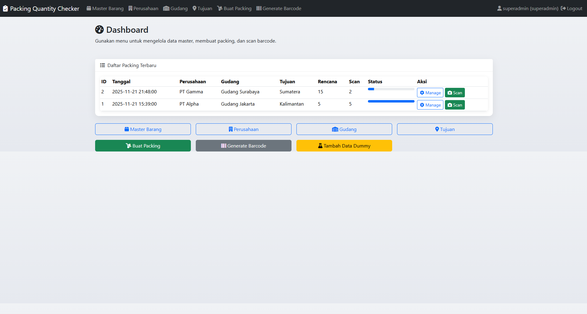
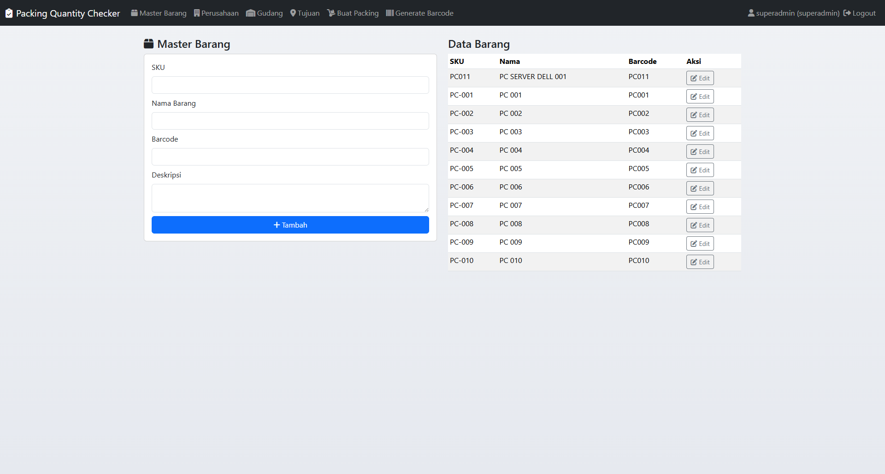
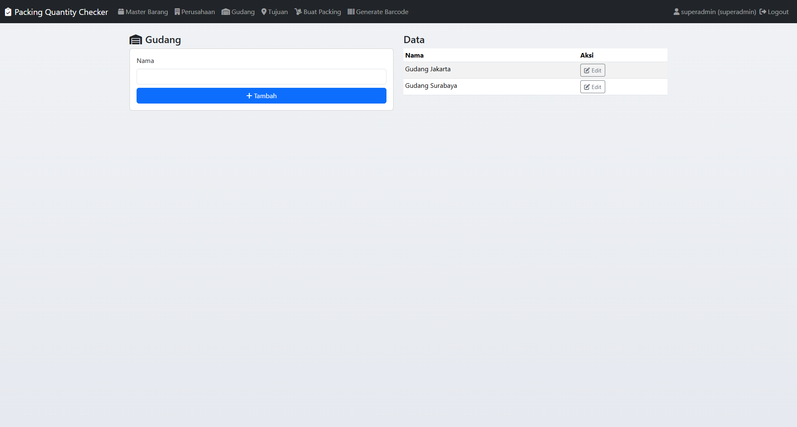
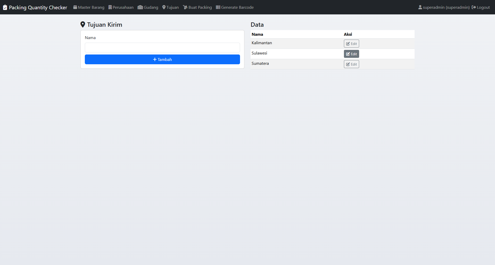
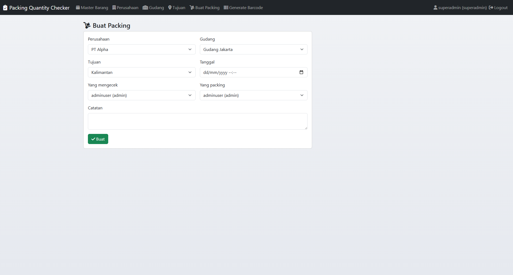
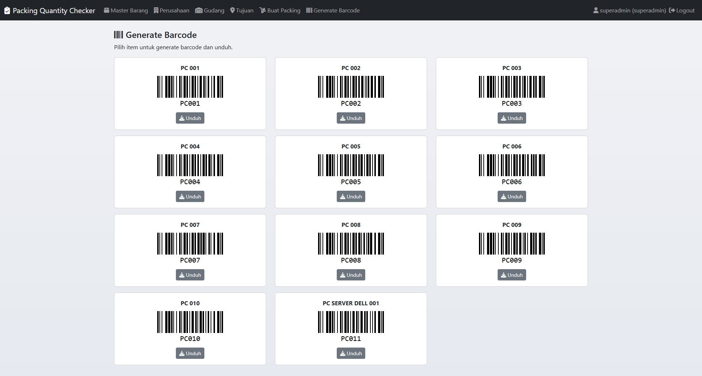

# Inventory Check (ID/EN)

## Ringkasan (ID)
- Aplikasi web ringan untuk memastikan jumlah barang sesuai sebelum packing dan pengiriman.
- Fitur: master data, workflow packing, scan barcode (hardware/ kamera), generate barcode, role-based access, dashboard progres, dan dukungan offline untuk library.

## Summary (EN)
- Lightweight web app to verify item quantities before packing and shipping.
- Features: master data, packing workflow, barcode scanning (hardware/camera), barcode generation, role-based access, progress dashboard, and offline library support.

---

## Instalasi (ID)
- Prasyarat
  - `PHP >= 8.0` dan `Composer` (opsional, tidak wajib).
  - MySQL/MariaDB (Laragon disarankan). 
  - Browser modern (Chrome/Edge) untuk kamera dan WebHID.
- Database
  - Buat database `checkinventorydb` di MySQL Laragon.
  - Kredensial contoh: host `127.0.0.1`, user `<user_db_anda>`, pass `<password_db_anda>`.
  - Anda dapat mengubah di `includes/config.php`.
- Menjalankan
  - Opsi Laragon (disarankan): letakkan folder di `C:\laragon\www\iventorycheck` lalu akses `http://localhost/iventorycheck/` atau virtual host `.test` jika aktif.
  - Opsi PHP built‑in server: jalankan `php -S 127.0.0.1:8010 -t .` dari root proyek, akses `http://127.0.0.1:8010/`.
- Setup awal
  - Buka `http://.../setup.php`, sistem membuat schema dan meminta Anda membuat akun `superadmin` (opsional tambah `admin`).
  - Setelah itu login via `http://.../login.php`.

## Installation (EN)
- Prerequisites
  - `PHP >= 8.0` and optionally `Composer`.
  - MySQL/MariaDB (Laragon recommended).
  - Modern browser (Chrome/Edge) for camera and WebHID.
- Database
  - Create database `checkinventorydb` in MySQL (Laragon).
  - Example credentials: host `127.0.0.1`, user `<user_db_anda>`, pass `<password_db_anda>`.
  - You can change them in `includes/config.php`.
- Run
  - Laragon option: put the folder under `C:\laragon\www\iventorycheck` then visit `http://localhost/iventorycheck/` or a `.test` virtual host if enabled.
  - PHP built‑in server: run `php -S 127.0.0.1:8010 -t .` from project root, visit `http://127.0.0.1:8010/`.
- First setup
  - Open `http://.../setup.php`, the system creates the schema and asks you to create a `superadmin` account (optional `admin`).
  - Then login via `http://.../login.php`.

---

## Fitur (ID)
- Login & Role
  - `superadmin`: dapat mengedit/update data master, mengubah qty rencana.
  - `admin`: hanya bisa entry (tambah data), tidak bisa edit yang ada.
- Master Data
  - Barang: `SKU`, `Nama`, `Barcode`, `Deskripsi`.
  - Perusahaan, Gudang, Tujuan.
- Workflow Packing
  - Input tanggal, perusahaan, gudang, tujuan, petugas pengecek dan packing, catatan.
  - Tambah item beserta `qty rencana`, scan untuk menaikkan `qty scan` sampai terpenuhi.
- Scan Barcode
  - Hardware scanner (mis. Honeywell Xenon 1900) dengan keyboard wedge detection (tanpa Enter tetap terdeteksi).
  - Kamera (jika library tersedia dan browser mengizinkan).
  - Sanitasi input (hapus CR/LF/TAB/space) dan pencocokan case-insensitive.
- Generate Barcode
  - Format Code128 per item, unduh `SVG`.
- Dashboard
  - Daftar packing terbaru dengan progres (planned vs scanned), tombol `Manage` dan `Scan`.
- Keamanan
  - PDO + prepared statements, CSRF token di setiap form tulis, session-based auth.
- Offline Library
  - JsBarcode lokal: `assets/vendor/jsbarcode.min.js`.
  - Html5 Qrcode lokal fallback: `assets/vendor/html5-qrcode.min.js` (kamera akan memberi peringatan jika CDN tak tersedia; hardware scanner tetap berfungsi).

## Features (EN)
- Login & Roles
  - `superadmin`: can edit/update master data and planned qty.
  - `admin`: entry-only, cannot edit existing records.
- Master Data
  - Items: `SKU`, `Name`, `Barcode`, `Description`.
  - Companies, Warehouses, Destinations.
- Packing Workflow
  - Input date, company, warehouse, destination, checker, packer, notes.
  - Add items with `planned qty`, scan increments `scanned qty` until fulfilled.
- Barcode Scanning
  - Hardware scanners (e.g., Honeywell Xenon 1900) via keyboard wedge detection (works without Enter).
  - Camera (if library is available and browser allows).
  - Input sanitization and case‑insensitive matching.
- Barcode Generation
  - Code128 per item, download as `SVG`.
- Dashboard
  - Recent packings with progress (planned vs scanned), actions `Manage` and `Scan`.
- Security
  - PDO + prepared statements, CSRF tokens on write forms, session auth.
- Offline Libraries
  - Local JsBarcode: `assets/vendor/jsbarcode.min.js`.
  - Local Html5 Qrcode fallback: `assets/vendor/html5-qrcode.min.js` (camera shows warning if CDN is unreachable; hardware scanner continues to work).

---

## Cara Pakai (ID)
- Isi master data: Barang, Perusahaan, Gudang, Tujuan.
- Buat Packing: pilih data terkait, tanggal, checker, packer.
- Tambah item dan `qty rencana` pada `Manage Packing`.
- Buka `Scan`: klik `Connect Scanner`, gunakan hardware scanner atau kamera; progres akan naik hingga mencapai rencana.
- Generate Barcode: buka halaman generate, pilih item, unduh `SVG`.

## Usage (EN)
- Fill master data: Items, Companies, Warehouses, Destinations.
- Create Packing: select related data, date, checker, packer.
- Add items and `planned qty` on `Manage Packing`.
- Open `Scan`: click `Connect Scanner`, use hardware scanner or camera; progress increases until planned qty.
- Generate Barcode: open generate page, pick item, download `SVG`.

---

## Troubleshooting
- Menu 404 atau URL salah: pastikan akses via `http://localhost/iventorycheck/` atau `http://127.0.0.1:8010/`; aplikasi memakai `APP_URL` otomatis untuk link absolut.
- Kamera tidak berjalan: cek izin kamera browser; jika offline dan CDN gagal, gunakan hardware scanner.
- Scan tidak naik: pastikan item dengan barcode itu sudah ditambahkan ke packing dan `qty rencana > 0`.

## Lisensi
- Internal usage.

---

## Donasi (ID)
- Mendukung pengembangan open source Ammarindo Solution.
- Link donasi: `https://www.paypal.com/ncp/payment/7GX4CF5VTZC4S`
- Donate to Ammarindo Solution – Open Source Support
- 

## Donations (EN)
- Support Ammarindo Solution open source development.
- Donation link: `https://www.paypal.com/ncp/payment/7GX4CF5VTZC4S`
- Donate to Ammarindo Solution – Open Source Support
- 

---

## Database & Seeder
- SQL schema: `db/init_db.sql` (dibuat otomatis via `setup.php`).
- SQL seed sample: `db/seed_dummy.sql` (companies, warehouses, destinations, 10 PC items).
- PHP seeder: `scripts/seed.php`.

### Jalankan Seeder (ID)
- Pastikan database `checkinventorydb` tersedia dan kredensial benar di `includes/config.php`.
- Dari root proyek, jalankan: `php scripts/seed.php`.
- Seeder akan membuat schema bila belum ada dan menambahkan data dummy.

### Run Seeder (EN)
- Ensure `checkinventorydb` exists and credentials set in `includes/config.php`.
- From project root, run: `php scripts/seed.php`.
- The seeder will create schema if missing and insert dummy data.

---

## Cuplikan Layar (ID)

## Screenshots (EN)

